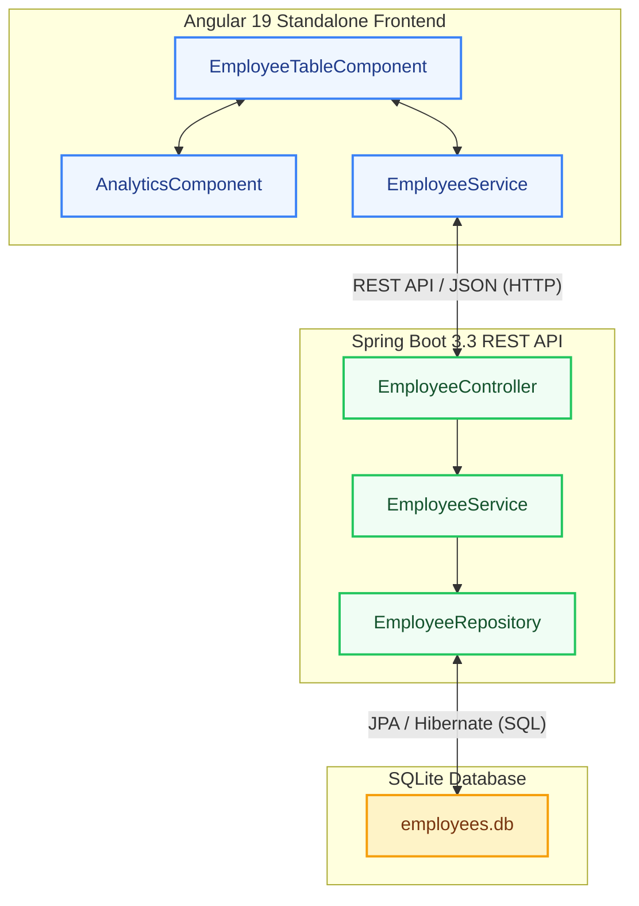

# Architectural Design & System Documentation

## System Architecture


Here is the full text of `ARCHITECTURE.md`. Copy everything inside the block below and paste it directly into your file:

```markdown
# Architectural Design & System Documentation

## System Architecture


---

## Technical Highlights

### 1. Deterministic Data Seeding (10k Records)

* Uses **DataFaker** combined with batch inserts (`saveAll`) wrapped inside `@EventListener(ApplicationReadyEvent.class)`.
* Populates 10,000 global employee records on startup if the database is unseeded.

### 2. High-Performance Pagination (`Pageable`)

* Implements Spring Data `Pageable` (`PageRequest.of(page, size, Sort.by(...))`).
* Translates to native SQL `LIMIT` and `OFFSET` queries in SQLite to guarantee low memory usage and sub-100ms API response times.

### 3. Unified Loading & Error Handling

* Integrates `forkJoin` and `finalize()` in Angular to load analytics and paginated records concurrently.
* Uses `ChangeDetectorRef.detectChanges()` to prevent zone change detection issues and spinner stalls.

---

## Analytics Calculation Strategy

* Analytics are computed server-side via custom JPQL/SQL aggregate functions (`SUM`, `AVG`, `COUNT`) to keep memory footprint low.
* Median salary is calculated via native SQL window functions over the filtered set.

```

```